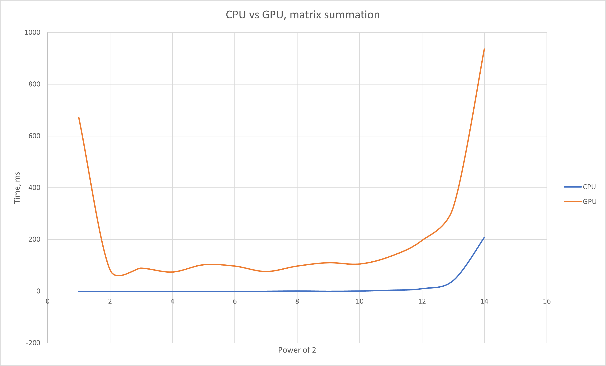
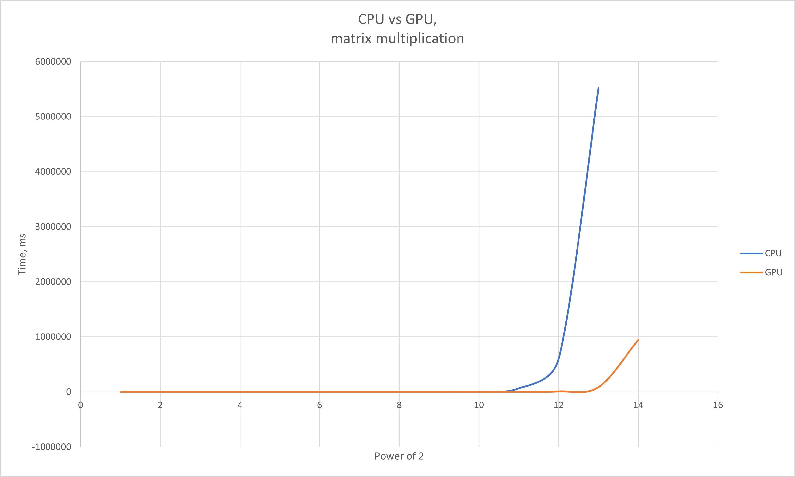

# JavaGPU

## General thoughts
The app is a simple program created for comparison of CPU and GPU computings. Aparapi is used for GPU computings access. Programs for both CPU and GPU are identical in algorithmic sense.  If you don't agree, write me down to issues.

## Precisely
### Matrix summation
Let's look at graphs. Probably, we suppose GPU will faster summarize matrices than CPU. But it's slower in 100%. In this experiment I used matrices 2^i*2^i, i from 1 to 14. I have no explainations of this phenomenon. Also we see a point where linear functional dependence becomes exponential. I guess that's a point where GPU uses all possible computing cores and it spends a lot of time to use then again.

Matrix summation:

### Linear search.
GPU loses in 100% of cases again. I read somewhere that GPU cannot afford logical expressions. I suppose it delegates logical functions to CPU and continues computings. So it takes really a lot of time.

Linear search:

### Matrix multiplication
GPU wins when matrices are big. In my experiment from 262K elements. So GPU is extremely effective in this case. Just look at the graph:

### Radix sort
Read in an article it's theoretically the only sort that can be realised for GPU. However its productivity is horrible.

### Bubble sort
Was made for fun only, but with really big arrays GPU in this case works faster than CPU.

## Summary
I personally wouldn't use GPU in Java cause of its unpredictable, unstable results. However maybe you'll be interested in that after my article and try to optimize your computings via it.
